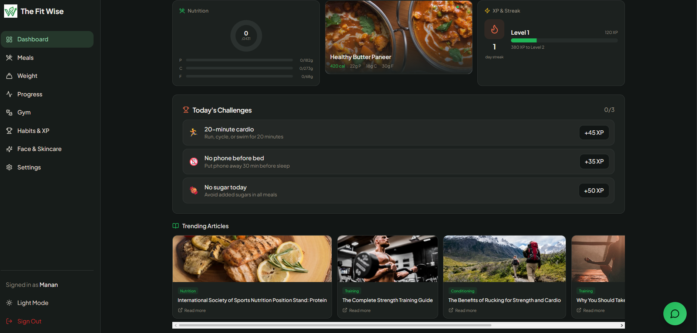
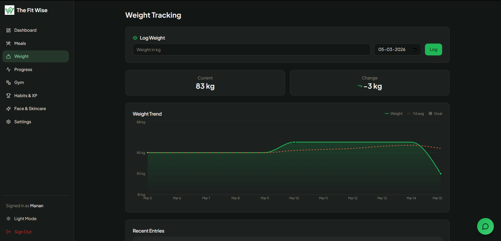
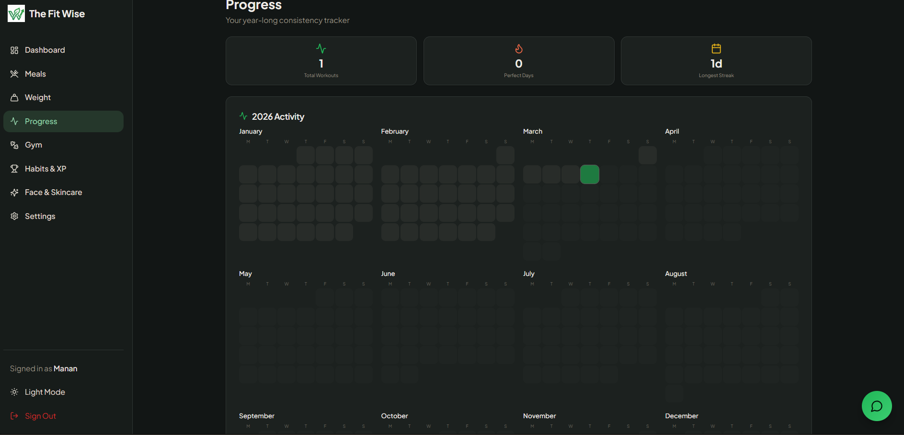

<div align="center">

#  FitWise

[](https://react.dev/)
[](https://vitejs.dev/)
[](https://developer.mozilla.org/en-US/docs/Web/JavaScript)
[](https://tailwindcss.com/)
[](https://supabase.com/)
[](https://www.framer.com/motion/)
[](https://vercel.com/)

**A full-stack AI-powered health & wellness companion — track meals, workouts, weight, hydration, habits, skincare, and more, all from one beautiful dashboard.**

### 🔗 [Live Demo → thefitwise.vercel.app](https://thefitwise.vercel.app/)

</div>

---

## 📸 Screenshots





---

## 🧠 Overview

FitWise is an all-in-one personal health platform that combines **AI-driven nutrition analysis**, **workout logging**, **weight charting**, **hydration tracking**, **skincare routines**, and a **gamified habit system** into a single responsive dashboard. Built with a modern React + Vite frontend and a Supabase backend (Auth, PostgreSQL, Edge Functions), it's designed to be fast, beautiful, and genuinely useful.

---

## ✨ Features

| Module                       | Description                                                                                                                                                     |
| ---------------------------- | --------------------------------------------------------------------------------------------------------------------------------------------------------------- |
| 🤖 **AI Meal Analysis**      | Describe what you ate in plain English — AI returns a per-item breakdown of calories, protein, carbs, fat, sodium, and potassium.                               |
| 📊 **Dashboard**             | Personalized daily overview with calorie progress, workout count, streak counter, XP bar, and daily challenges.                                                 |
| 🏋️ **Gym & Workouts**        | Full exercise library with 50+ exercises across muscle groups, pre-built templates (Push/Pull/Legs/Core), quick check-ins, and a mini-calendar for active days. |
| ⚖️ **Weight Tracking**       | Interactive line chart with 7-day rolling average to visualize real trends beyond daily fluctuations.                                                           |
| 🍽️ **Meal Logging**          | Manual food logging with a searchable database of 100+ items, or let AI handle it for you.                                                                      |
| 💧 **Water & Caffeine**      | Track daily water intake and caffeine consumption with quick-add buttons.                                                                                       |
| 🏆 **Habits & Gamification** | XP system, leveling, streak tracking, and unlockable badges like _Consistency King_ and _Century Club_.                                                         |
| 🧴 **Face & Skincare**       | Morning/evening skincare checklists plus face exercises with duration tracking via an accurate built-in timer.                                                  |
| 💬 **FitWise Chat**          | In-app AI chat widget for quick wellness questions and guidance.                                                                                                |
| ⚙️ **Settings**              | Profile setup with auto-calculated daily calorie goals using the Mifflin-St Jeor formula.                                                                       |

---

## 🔬 How AI Meal Analysis Works

```
1. You type: "2 boiled eggs, toast with butter, and black coffee"
2. Request hits a Supabase Edge Function
3. Edge Function calls OpenAI (gpt-4o-mini) with a clinical nutritionist prompt
4. You get back individual items with precise macros
5. Everything is auto-logged to your daily tracker
```

---

## 🛠️ Tech Stack

| Layer                | Technology                                     |
| -------------------- | ---------------------------------------------- |
| **Frontend**         | React 18, Vite 5, JavaScript (ES2020)          |
| **Styling**          | Tailwind CSS 3, shadcn/ui, Radix UI Primitives |
| **Animations**       | Framer Motion                                  |
| **Charts**           | Recharts                                       |
| **State Management** | TanStack React Query                           |
| **Routing**          | React Router v6                                |
| **Backend**          | Supabase (Auth, PostgreSQL, Edge Functions)    |
| **AI**               | OpenAI API (`gpt-4o-mini`)                     |
| **Hosting**          | Vercel                                         |
| **Testing**          | Vitest, React Testing Library                  |

---

## 📁 Project Structure

```
src/
├── components/
│   ├── ui/              # shadcn/ui primitives (button, dialog, toast, etc.)
│   ├── AppLayout.jsx    # Main app shell with sidebar + bottom nav
│   ├── FitwiseChat.jsx  # AI chat widget
│   ├── LivePractice.jsx # Live practice / timer component
│   └── NavLink.jsx      # Navigation link component
├── hooks/
│   ├── useAuth.js       # Authentication state
│   ├── useMeals.js      # Meal CRUD operations
│   ├── useWorkouts.js   # Workout logging
│   ├── useWeightLogs.js # Weight tracking
│   ├── useWaterLogs.js  # Water intake
│   ├── useCaffeineLogs.js # Caffeine tracking
│   ├── useUserStats.js  # XP, level, streaks
│   ├── useProfile.js    # User profile & settings
│   └── useAccurateTimer.js # Precision timer for exercises
├── integrations/        # Supabase client configuration
├── lib/
│   ├── foodDatabase.js  # 100+ food items with full macro data
│   ├── gymExercises.js  # 50+ exercises organized by muscle group
│   ├── workoutData.js   # Pre-built workout templates
│   ├── challenges.js    # Daily challenge definitions
│   ├── dashboardData.js # Dashboard computation helpers
│   └── utils.js         # General utilities
├── pages/
│   ├── DashboardPage.jsx
│   ├── MealsPage.jsx
│   ├── GymPage.jsx
│   ├── WorkoutsPage.jsx
│   ├── WeightPage.jsx
│   ├── HabitsPage.jsx
│   ├── FaceCarePage.jsx
│   ├── SettingsPage.jsx
│   └── AuthPage.jsx
└── test/                # Unit tests

supabase/
├── functions/
│   └── analyze-meal/    # Edge function for AI meal analysis
└── migrations/          # PostgreSQL schema migrations
```

---

## 🚀 Getting Started

### Prerequisites

- **Node.js** ≥ 18
- **npm** ≥ 9
- A **Supabase** project (free tier works)
- An **OpenAI API key** (for AI meal analysis)

### Installation

```bash
# Clone the repository
git clone https://github.com/your-username/thefitwise.git
cd thefitwise

# Install dependencies
npm install

# Set up environment variables
cp .env.example .env
```

### Environment Variables

Create a `.env` file in the root with:

```env
VITE_SUPABASE_PROJECT_ID=your_supabase_project_id
VITE_SUPABASE_PUBLISHABLE_KEY=your_supabase_anon_key
VITE_SUPABASE_URL=https://your-project.supabase.co
```

For the AI meal analysis edge function, set the `OPENAI_API_KEY` in your Supabase project's Edge Function secrets.

### Run Locally

```bash
# Start the dev server
npm run dev

# Open http://localhost:5173
```

### Build for Production

```bash
npm run build
npm run preview
```

### Run Tests

```bash
npm run test          # Single run
npm run test:watch    # Watch mode
```

---

## 📋 Feature Checklist

- [x] Email/password authentication via Supabase Auth
- [x] AI-powered meal analysis from natural language
- [x] Manual meal logging with full macro tracking
- [x] Searchable food database (100+ items)
- [x] Full gym exercise library (50+ exercises)
- [x] Pre-built workout templates and quick check-ins
- [x] Weight tracking with trend charts and rolling averages
- [x] Water intake tracking
- [x] Caffeine consumption tracking
- [x] XP, leveling, and streak system
- [x] Unlockable achievement badges
- [x] Daily challenges with XP rewards
- [x] Auto-calculated calorie goals (Mifflin-St Jeor)
- [x] Morning and evening skincare routines
- [x] Face exercise library with accurate duration timer
- [x] In-app AI chat widget
- [x] Responsive layout (mobile bottom nav ↔ desktop sidebar)
- [x] Smooth page transitions via Framer Motion
- [x] Deployed on Vercel

---

## 🗄️ Database Schema

The Supabase PostgreSQL database includes tables for:

- **profiles** — User settings, calorie goals, personal info
- **meals** / **meal_items** — Logged meals with per-item macro breakdowns
- **workouts** — Workout sessions and check-ins
- **weight_logs** — Daily weight entries
- **water_logs** — Water intake records
- **caffeine_logs** — Caffeine consumption records
- **user_stats** — XP, level, streaks, badges

Schema migrations are located in `supabase/migrations/`.

---

## 🤝 Contributing

Contributions are welcome! Feel free to open issues or submit pull requests.

1. Fork the repo
2. Create your feature branch (`git checkout -b feature/awesome-feature`)
3. Commit your changes (`git commit -m 'Add awesome feature'`)
4. Push to the branch (`git push origin feature/awesome-feature`)
5. Open a Pull Request

---

## 📄 License

This project is licensed under the [MIT License](LICENSE).

---

<div align="center">

**Built with ❤️ by the FitWise team**

[Live Demo](https://thefitwise.vercel.app/) · [Report Bug](https://github.com/your-username/thefitwise/issues) · [Request Feature](https://github.com/your-username/thefitwise/issues)

</div>
